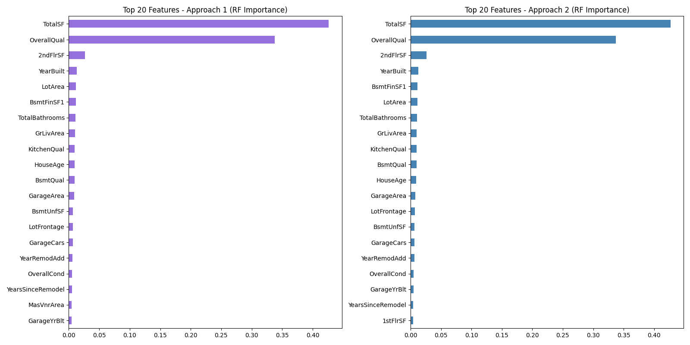
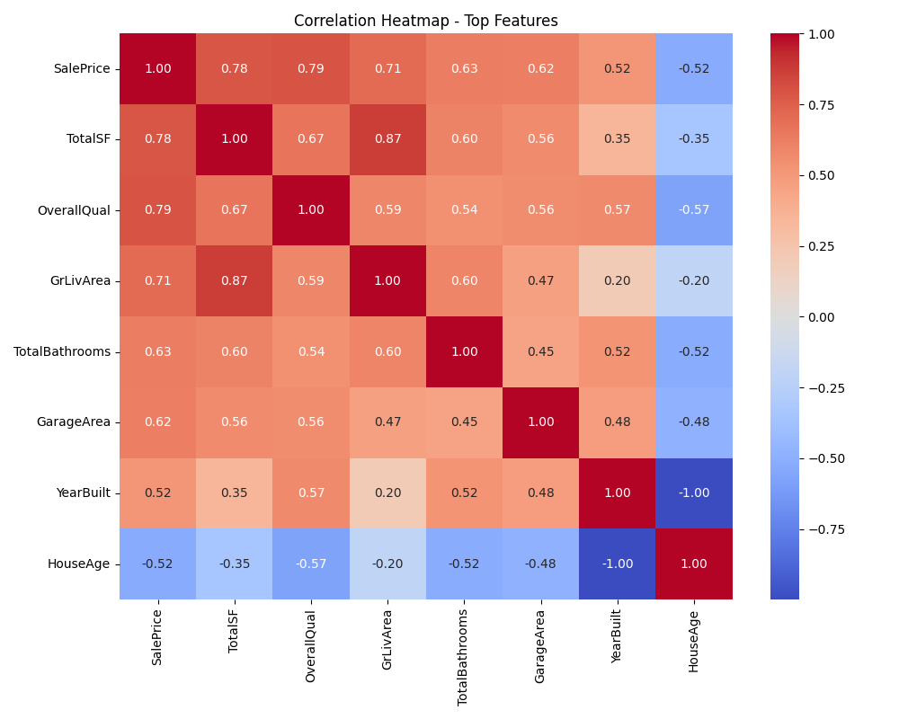
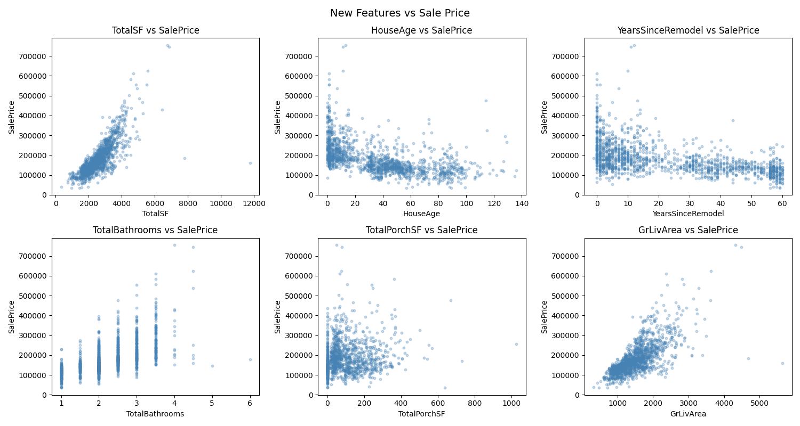
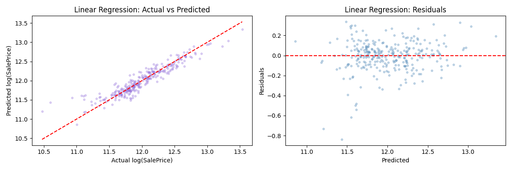
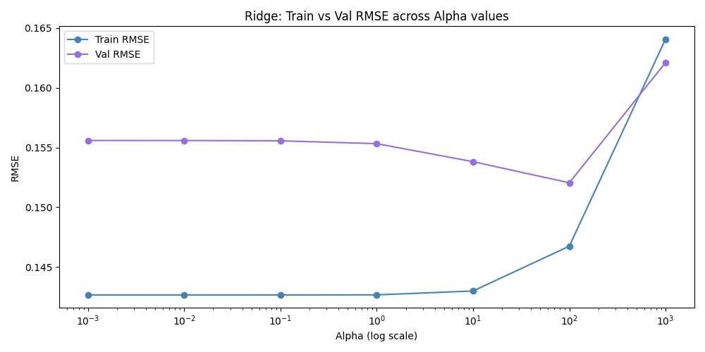
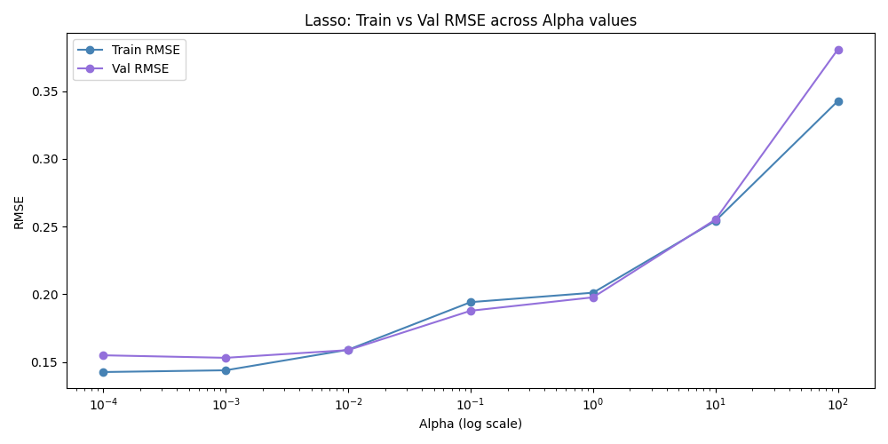
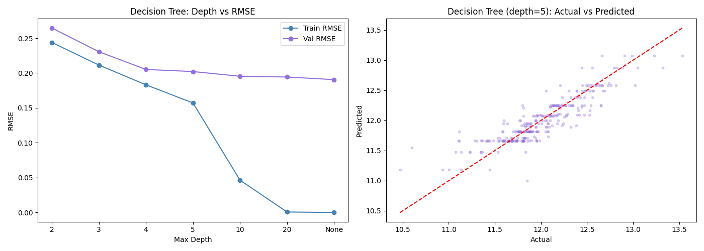
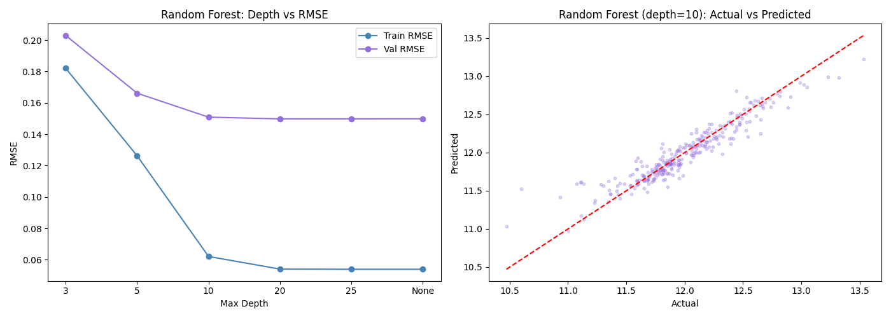
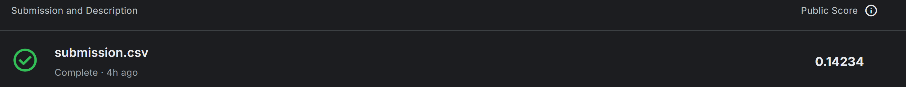

# 🏠 House Prices — Advanced Regression Techniques

## კონკურსის მიმოხილვა

Kaggle-ის House Prices კონკურსის მიზანია ამერიკის ქალაქებშუ სახლების გაყიდვის ფასის პროგნოზირება 79 მახასიათებლის მიხედვით. შეფასება ხდება **RMSLE** (Root Mean Squared Log Error) ის საფუძველზე
Kaggle-ზე მიღებული ქულა: **0.14234**

---

## რეპოზიტორიის სტრუქტურა

```
ml-assignment-house-prices/
│
├── model_experiment.ipynb   ← EDA, preprocessing, feature selection, ტრენინგი, MLflow ლოგირება
├── model_inference.ipynb    ← MLflow-იდან საუკეთესო მოდელის პარამეტრები, პროგნოზი, submission.csv-ის გენერირება
├── plots/                   ← ყველა ვიზუალიზაცია
│   ├── saleprice_distribution.png
│   ├── missing_values.png
│   ├── feature_correlations.png
│   ├── feature_importance.png
│   ├── correlation_heatmap.png
│   ├── ridge_alpha_analysis.png
│   ├── lasso_alpha_analysis.png
│   ├── decision_tree_analysis.png
│   └── random_forest_analysis.png
|   └── linear_regression_analysis.png
├── Data/
│   ├── train.csv
│   └── test.csv
│   └── sample_submission.csv
│   └── data_description.txt
├── submission.csv
├── score.png
└── README.md
```

---

## ფაილების აღწერა

| ფაილი | აღწერა |
|-------|--------|
| `model_experiment.ipynb` | მთავარი notebook — EDA-დან დაწყებული, გაწმენდა, feature engineering, feature selection, მრავალი მოდელის ტრენინგი სხვადასხვა ჰიპერპარამეტრებით. ყველა ექსპერიმენტი ილოგება MLflow-ში DagsHub-ზე. |
| `model_inference.ipynb` | საუკეთესო მოდელის ჩამოტვირთვა და submission-ის გენერაცია. |
| `submission.csv` | Kaggle-ზე ატვირთული პროგნოზები |

---

## მონაცემთა გაწმენდა (Cleaning)

მონაცემთა გასაწმენდად გამოვიყენე ორი მიდგომა, ექსპერიმენტსი საშულაებით დავადგინე რომელი იყო მათ შორის უკეთესი.


### მიდგომა 1

ამოვიღე სვეტები, სადაც გამოტოვებული მნიშვნელობათა რაოდენობა **20%-ზე** მეტი იყო. მთავარი მიზეზი ის არის, რომ როდესაც ძალიან ბევრი მონაცემი გვაკლია, ამ მნიშვნელობების შევსებამ შეიძლება გამოიწვიოს noise და სუსტი პატერნები, რომლებიც საბოლოოდ უსარგებლოა. დარჩენილი მნიშვნელობები მარტივი გზით შევავსე: რიცხვითი სვეტები **მედიანით**, ხოლო კატეგორიის სვეტები **მოდით**. რიცხვებისთვის მედიანა გამოვიყენე, რადგან ის უფრო სტაბილურია, როდესაც არის გამონაკლისები, ხოლო კატეგორიებისთვის მოდა, რადგან ის ინარჩუნებს ყველაზე გავრცელებულ მნიშვნელობას.

შედეგი: **75 feature**

### მიდგომა 2

აქ ჩანაცვლება გმომდინარეობდა თითოეული სვეტის მნიშვნელობიდან. ისეთი სვეტებისთვის, როგორიცაა `PoolQC`, `FireplaceQu` და `Alley`, დაკარგული მნიშვნელობები ხშირად ნიშნავს, რომ სახლს არ აქვს ეს ფუნქცია, ამიტომ შევავსე ისინი `'None'`-ით. ისეთი სვეტებისთვის, როგორიცაა `GarageArea` და `BsmtFinSF1`, დაკარგული მნიშვნელობები ხშირად ნიშნავს, რომ ასეთი ფართობი არ არსებობს, ამიტომ შევავსე ისინი `0`-ით. `LotFrontage`-ისთვის, დაკარგული მნიშვნელობები შევავსე იმავე `სამეზობლოს` მედიანას გამოყენებით, რადგან ერთი და იგივე ტერიტორიის სახლები, როგორც წესი, უფრო ჰგავს ერთმანეთს, ვიდრე სხვადასხვა ტერიტორიის სახლები.

შედეგი: **81 feature**

მეორე მიდგომამ ბევრად უკეთესად იმუშავა, რადგან ის უფრო სასარგებლო ინფორმაციას ინახავს და მონაცემებში რეალურ მნიშვნელობას ასახავს.

---

## Feature Engineering

არსებულ მონაცემებზე დაყრდნობითა და მათი გაერთიანებებით შევქმენი ახალი მახასიათებლები, რომლებიც ჩემი აზრით მჭიდრო კავშირშია სახლის ფასთან.


| ახალი feature | ფორმულა / იდეა |
|--------------|----------------|
| `TotalSF` | `TotalBsmtSF + 1stFlrSF + 2ndFlrSF` — სახლის სრული ფართობი |
| `HouseAge` | `YrSold − YearBuilt` — სახლის ასაკი გაყიდვის წელს |
| `YearsSinceRemodel` | `YrSold − YearRemodAdd` — ბოლო რემონტიდან გასული წლები |
| `TotalBathrooms` | `FullBath + BsmtFullBath + 0.5×HalfBath + 0.5×BsmtHalfBath` |
| `HasPool` | `1` თუ `PoolArea > 0` |
| `HasGarage` | `1` თუ `GarageArea > 0` |
| `HasBasement` | `1` თუ `TotalBsmtSF > 0` |
| `HasFireplace` | `1` თუ `Fireplaces > 0` |
| `TotalPorchSF` | ყველა ვერანდის ფართობის ჯამი |

---

## კატეგორიული ცვლადებისთვის რიცხვითი მნიშნელობის მინიჭება

### Ordinal Encoding

ზოგიერთი სვეტი აღწერს ხარისხის დონეებს (მაგალითად, `ExterQual`, `KitchenQual`, `BsmtQual`).
რადგან ამ მნიშვნელობებს აქვთ ბუნებრივი იერარქია (ცუდი -> საშუალო -> კარგი -> შესანიშნავი) მათი რიცხვებად გადაქცევით, მოდელისთვის უფრო გასაგები მონაცემები შევქმენით.

```
None → 0  |  Poor → 1  |  Fair → 2  |  TA → 3  |  Good → 4  |  Excellent → 5
```

### One-Hot Encoding

დარჩენილი კატეგორიული სვეტებისთვის, მნიშვნელობებს შორის რეალური თანმიმდევრობა არ არსებობს (მაგალითად, ერთი სამეზობლო არ არის „უფრო დიდი“, ვიდრე მეორე). ამიტომ გამოვიყენე ერთჯერადი კოდირება `pd.get_dummies(..., drop_first=True)`, რომელიც ქმნის ცალკეულ 0/1 სვეტებს თითოეული კატეგორიისთვის. train და test გავაერთიანე, რათა ყველა კატეგორია ორივე dataset-ში ერთნაირი შედეგები მიმეღო.

---

## Feature Selection

### ეტაპი 1 — Random Forest Feature Importance (Top-50)

თავდაპირველად დავატრენინგე `RandomForestRegressor(n_estimators=100, random_state=42)` სრულ feature სეტზე და ავირჩიეთ **50 ყველაზე 
მნიშვნელოვანი** feature.

ამ შემთხვევითი Random Forest-ი გამოვიყენე, როგორც **ფუნქციების შერჩევის ინსტრუმენტი**, რადგან მას შეუძლია არაწრფივი ურთიერთობებისა და ურთიერთქმედებების კარგი ასასხვა, ამიტომ მისი საშუალებით სუსტი ცვლადების ადრეულ ეტაპზე მოვიშორე, ყველა სვეტის ხელით შემოწმების გარეშე.





### Step 2 — Correlation Filter (Threshold = 0.85)



თუ ორი მახასიათებელი მაღალ კორელაციაშია, ისინი ძირითადად ერთსა და იმავე სიგნალს ატარებენ, ამიტომ ორივეს შენარჩუნება ახალი ინფორმაციის ნაცვლად ზედმეტ ინფორმაციას გვაძლებს. რამაც შეიძლება მოდელი ნაკლებად სტაბილურობა გამოიწვიოს და ინტერპრეტირება გაართულოს.

---

### როგორ შევარჩიე correlation threshold

threshold-ის შერჩევა ინფორმაციის შენარჩუნებასა და ზედმეტი ხმაურის მოცილებას შორის ბალანსის დასაცავად მნიშვნელოვანია.

თუ threshold ძალიან მაღალია ანუ სადღაც 0.95-მდე, მოდელში რჩება ბევრი ერთმანეთის მსგავსი feature. ეს ხშირად ზრდის მოდელის სირთულეს და overfitting-ის რისკს.

თუ threshold ძალიან 0.5-ის ფარგლებში, შეიძლება ზედმეტად ბევრი სასარგებლო feature წაიშალოს, რის გამოც მოდელი ზედმეტად გამარტივდება და underfitting მოხდება.

ამიტომ არჩევანი **0.85**-ზე გავაკეთე.



---

## ტრენინგი და ჰიპერპარამეტრების ოპტიმიზაცია

### 1. Linear Regression

სულ პირველად ვცადე უბრალო linear regression-ი.



| Dataset | val_rmse | train_rmse |
|---------|----------|------------|
| approach1_kbest | 0.1556 | 0.1427 |
| approach2_rf ✅ | 0.1461 | 0.1354 |

დასკვნა: approach2 (RF feature selection) უკეთ მუშაობს.

---

### 2. Ridge Regression (L2 Regularization)

Ridge-ი - ამცირებს overfitting-ს. შევამოწმე `alpha` პარამეტრის ცვლილებას რა გავლენა ექნებოდა შედეგებზე:
გატესტილი `alpha` მნიშვნელობები: **[0.001, 0.01, 0.1, 1, 10, 100, 1000]**



| alpha | val_rmse | train_rmse | შეფასება |
|-------|----------|------------|----------|
| 0.01 | 0.1461 | 0.1354 | ბეისლაინი |
| 0.1 | 0.1461 | 0.1354 | ოპტიმალური |
| 1 | 0.1460 | 0.1354 | საუკეთესო |
| 10 | 0.1461 | 0.1358 | ოდნავ უარესი |
| 100 | 0.1478 | 0.1390 | underfitting იწყება |

დასკვნა: alpha = 1 ოპტიმალურია. ძალიან დიდი alpha = 100 იწვევს **underfitting**-ს.

---

### 3. Lasso Regression (L1 Regularization)

Lasso განსაკუთრებულია ეფექტურად ახდენს ავტომატური ფუნქციების შერჩევას.
გატესტილი `alpha` მნიშვნელობები: **[0.0001, 0.001, 0.01, 0.1, 1, 10, 100]**



| alpha | val_rmse | train_rmse | შეფასება |
|-------|----------|------------|----------|
| 0.0001 | 0.1459 | 0.1354 | ბეისლაინთან ახლოს |
| **0.001** | **0.1457** | **0.1364** | საუკეთესო |
| 0.01 | 0.1496 | 0.1413 | regularization იზრდება |
| 0.1 | 0.1890 | 0.1871 | underfitting |
| 1.0 | 0.3995 | 0.3994 | თითქმის ყველა კოეფიციენტი 0-ია |

დასკვნა: alpha = 0.001 იძლევა ყველაზე დაბალ val_rmse-ს (0.1457) და train/val სხვაობა მინიმალურია.

---

### 4. Decision Tree



ჰიპერპარამეტრები: `max_depth` = **[2, 3, 4, 5, 10, 20, None]**, `min_samples_split` = **[2, 4, 5, 10]**

| max_depth | train_rmse | val_rmse | შეფასება |
|-----------|------------|----------|----------|
| 3 | 0.2100 | 0.2150 | *underfitting |
| 5 | 0.1650 | 0.1780 | ბალანსირებული |
| 10 | 0.0900 | 0.1950 | overfitting |
| 20 | 0.0310 | 0.2100 | ძლიერი overfitting |
| None | 0.0000 | 0.2300 | ყველაფერს იმახსოვრებს |

დასკვნა: Decision Tree-ის სიღრმეს დიდი მნიშვნელობა აქვს.როდესაც `max_depth = None` მოდელი თითქმის იდეალურად სწავლობს მონაცემებს, მაგრამ overfitting-ს აკეთებს, როდესაც `max_depth=3' მოდელი სუსტია და underfitting ხდება. ამგვარად, საუკეთესო შედეგი მიიღება საშუალო სიღრმიდან, სადაც მოდელი საკმარისად რთულია შესასწავლად, მაგრამ არა იმდენად რთული, რომ noise იმახსოვროს.

---

### 5. Random Forest



ჰიპერპარამეტრები: `n_estimators` = **[50, 100, 200, 300]**, `max_depth` = **[3, 5, 10, 20, 25, None]**

| n_estimators | max_depth | val_rmse | train_rmse | შეფასება |
|--------------|-----------|----------|------------|----------|
| 100 | 3 | 0.1882 | 0.1696 | underfitting |
| 100 | 5 | 0.1650 | 0.1204 | კარგი |
| 100 | 10 | 0.1508 | 0.0588 | overfitting |
| 300 | 20 | 0.1497 | 0.0522 | overfitting |
| 300 | None | 0.1493 | 0.0522 | ძლიერი overfitting |


დასკვნა: Random Forest-მა ძლიერი ტრენინგის შედეგები აჩვენა, რომ მოდელმა ძალიან კარგად ისწავლა ტრენინგის ნიმუშები, მაგრამ ზედმეტად კარგი აღმოჩნდა რამაც overfitting გამოიწვია.
ამგვარად, Random Forest-მა კარგად მუშაობს, მაგრამ ჩემი დამუშავების შემთვევაში Lasso უფრო დაბალანსებული იყო და ამ მონაცემთა ნაკრებზე უკეთესი საბოლოო შედეგი აჩენა.


---

## საუკეთესო მოდელის შერჩევა

ყველა ექსპერიმენტი შედარდა `val_rmse`-ს მიხედვით MLflow-ის მეშვეობით:

`val_rmse` ავირჩიე მთავარი შესადარებელი მეტრიკად, რადგან ის საუკეთესოდ აჩვენებს რამდენად კარგად მუშაობს მოდელი ახალ, უხილავ მონაცემებზე.ამ მეტირიკით დიდი შეცდომები უფრო მკაცრად ჯარიმდება, ამიტომ თუ მოდელი ზოგიერთ სახლზე ძალიან ცდება, `val_rmse` ამას მკაფიოდ გვანახებს. ეს მნიშვნელოვანი იყო ჩემთვის, რადგან House Prices-ის ამოცანაში მიზანია არა უბრალოდ საშუალო სიზუსტე, არამედ სტაბილური და სანდო პროგნოზირებაა.

```python
best_run = mlflow.search_runs(
    experiment_names=["linear_regression", "ridge_regression",
                      "lasso_regression", "decision_tree", "random_forest"],
    order_by=["metrics.val_rmse ASC"]
).iloc[0]
```

**გამარჯვებული: Lasso (alpha=0.001, approach2_rf)**

| მეტრიკა | მნიშვნელობა |
|--------|-------------|
| val_rmse | **0.1457** |
| train_rmse | 0.1364 |
| val_mae | ~0.1050 |
| cv_rmse (5-fold) | ~0.1476 |
| Kaggle Score | **0.14234** |



---

## MLflow ექსპერიმენტები DagsHub-ზე

**ყველა ექსპერიმენტი ასახულია:** [dagshub.com/lchit22/ml-assignment-house-prices](https://dagshub.com/lchit22/ml-assignment-house-prices.mlflow)

თითოეულ run-ში დაილოგა:

- **პარამეტრები:** `model`, `dataset`, `alpha`, `n_estimators`, `max_depth`, `min_samples_split`  
  (model-ის მიხედვით იცვლება: მაგალითად Ridge/Lasso-ში `alpha`, Decision Tree-ში `max_depth` და `min_samples_split`, Random Forest-ში `n_estimators` და `max_depth`)
- **მეტრიკები:** `train_rmse`, `val_rmse`, `train_mae`, `val_mae`, `train_r2`, `val_r2`, `cv_rmse_mean`, `cv_rmse_std`


`val_rmse` ავირჩიე მთავარ შერჩევის მეტრიკად, რადგან ის პირდაპირ მაჩვენებს როგორ მუშაობს მოდელი ახალ (validation) მონაცემებზე, მისი საშუალებით დიდი შეცდომები უფრო მკაცრად ისჯება. ეს განსაკუთრებით მნიშვნელოვანია House Prices ამოცანაში, სადაც რამდენიმე დიდი აცდენა საბოლოო შედეგს მნიშვნელოვნად აუარესებს.

`train_rmse` და `val_rmse` ერთად დავლოგე, რათა მოდელის განზოგადება შემეფასებინა: თუ train-ზე შეცდომა ძალიან დაბალია და validation-ზე მაღალი, ეს overfitting-ის ნიშანია. თუ ორივეგან მაღალია, ეს underfitting-ზე მიუთითებს. ანუ ამ ორი მეტრიკის წყვილი მაძლევს სურათს არა მხოლოდ "რამდენად ზუსტია" მოდელი, არამედ "რამდენად სტაბილურად" მუშაობს ის უცნობ მონაცემებზე.

`mae` დავამატე იმიტომ, რომ RMSE-სგან განსხვავებით საშუალო აბსოლუტურ შეცდომას უფრო ინტუიციურად აჩვენებს. 

`r2` ვარიაციის სანახავად.

ასევე `cv_rmse_mean` და `cv_rmse_std` დამეხმარა მენახა, იყო თუ არა შედეგი სტაბილური სხვადასხვა fold-ზე და კონკრეტულ split-ზე შემთხვევით ზედმეტად ხომ არ მიმართლებდა.

---


### ექსპერიმენტების სტრუქტურა

| Experiment | Run Volume | Parameters Explored |
|-----------|------------|---------------------|
| `linear_regression` | 2 runs | dataset (approach1/approach2) |
| `ridge_regression` | 14 runs | alpha = [0.001, 0.01, 0.1, 1, 10, 100, 1000] x 2 datasets |
| `lasso_regression` | 14 runs | alpha = [0.0001, 0.001, 0.01, 0.1, 1, 10, 100] x 2 datasets |
| `decision_tree` | 56 runs | max_depth = [2, 3, 4, 5, 10, 20, None], min_samples_split = [2, 4, 5, 10] x 2 datasets |
| `random_forest` | 48 runs | n_estimators = [50, 100, 200, 300], max_depth = [3, 5, 10, 20, 25, None] x 2 datasets |
| **Total** | **134 runs** | tracked in MLflow |

---

## გამოცდილება და დასკვნები

ამ პროექტმა პრაქტიკულად დამანახა, რომ კარგი შედეგი მხოლოდ მოდელის არჩევაზე არ არის დამოკიდებული. ყველაზე დიდი გავლენა ჰქონდა მონაცემების სწორად დამუშავებას: missing values-ის აზრობრივ შევსებას, ახალი feature-ების შექმნას და redundant ცვლადების მოცილებას. 

ამ პროექტის საშუალებით ვისწავლე რომ:
- მონაცემის მნიშვნელობის მიხედვით preprocessing უფრო ძლიერია, ვიდრე უნივერსალური/მექანიკური წესები.
- სწორი metric-ის არჩევა (აქ `val_rmse`) განსაზღვრავს სწორ model selection-ს.
- regularization (განსაკუთრებით Lasso) არა მხოლოდ overfitting-ს აკონტროლებს, არამედ feature selection-შიც მეხმარება.
- ექსპერიმენტების სწორი ტრეკინგი (MLflow) ისეთივე მნიშვნელოვანია, როგორც თავად მოდელის ტრენინგი.

